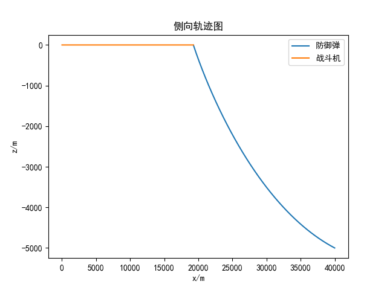
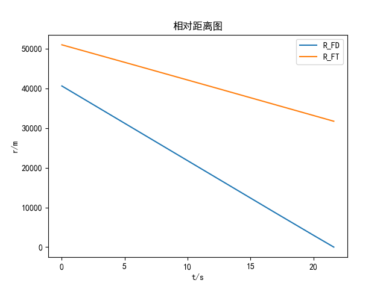
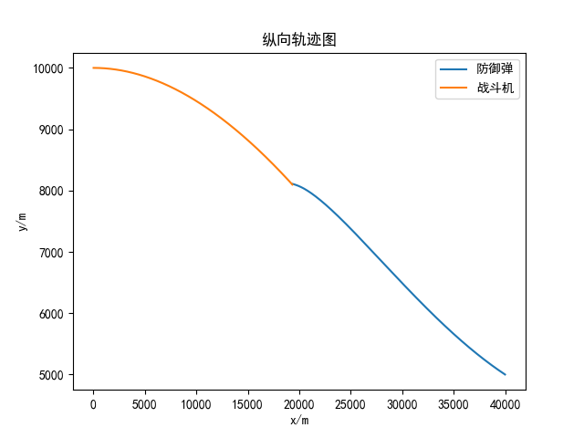
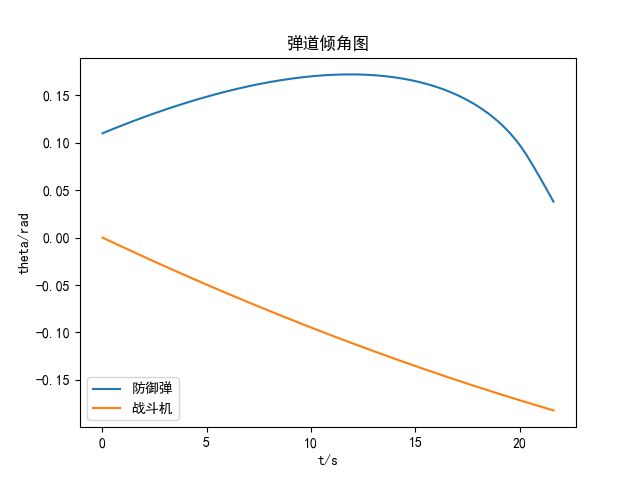
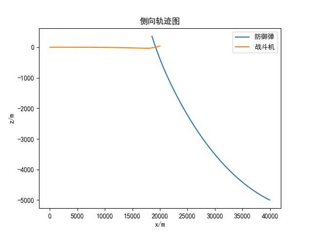
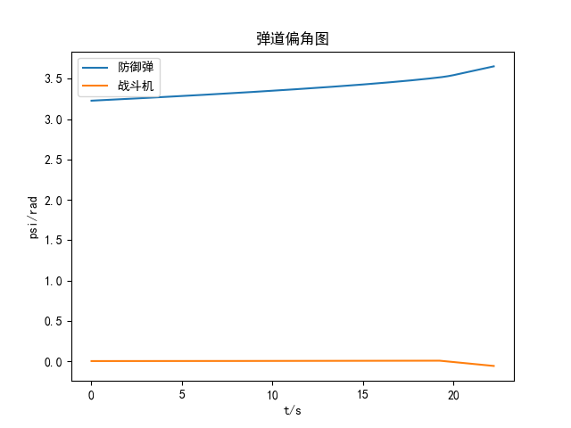
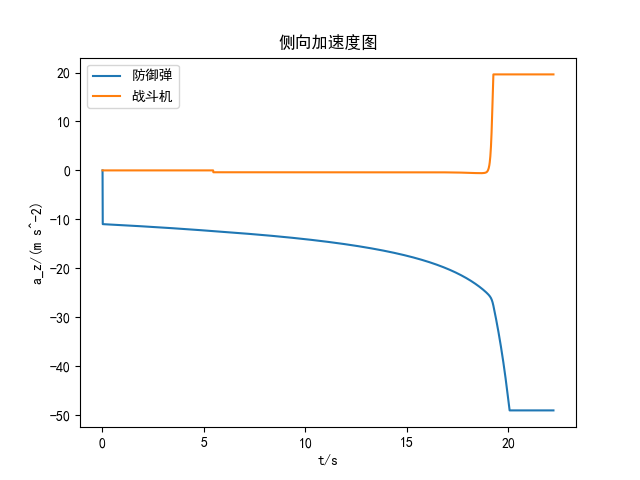

# 基于深度强化学习的战斗机机动突防方法研究 复现
仓库：https://github.com/weilinyin/fighter_Deep_Reinforcement_Learning

## 奖励函数设计

$$
R = 
\begin{cases}
K^+ , & r_{FT}\leq r^*_{FT} \: \&  \: \dot r_{FD} > 0  \:\&\: r_{FD} > r_{dam} \:\& \:\eta_{FT}\leq \eta^*_{FT}  \\
0 , & r_{FT}\leq r^*_{FT} \:\&\: \dot r_{FD} > 0 \:\&\: r_{FD} > r_{dam} \:\&\: \eta_{FT} > \eta^*_{FT}  \\
K^- , & r_{FT} < r^*_{FT} \\
\Sigma R_i , & else
\end{cases}
$$

$$
R_1 = 
\begin{cases}
K_{R1} \cos \eta_{FT} , & \eta_{FT} \leq \eta^*_{FT} \\
-0.05 , & \eta_{FT} > \eta^*_{FT}
\end{cases}
$$

$$
R_2 = 
\begin{cases}
-K_{R2}e^{-\frac{r_{FD}}{100}} , & \eta_{FT} \leq \eta^*_{FT} \\
-0.05 , & \eta_{FT} > \eta^*_{FT}
\end{cases}
$$

$$
R_3 = -K_{R3}a_F^2
$$

## 无突防策略仿真

双方均使用比例导引法，$ N = 3 $

### 二维

### 三维

## 基于PPO

### 二维

二维平面突防网络的结构参数及激活函数

|         | Actor      |          | Critic     |          |
| ------- | ---------- | -------- | ---------- | -------- |
|         | 神经元个数 | 激活函数 | 神经元个数 | 激活函数 |
| 输入层  | 4          | -        | 4          | -        |
| 隐藏层1 | 160        | ReLU     | 200        | ReLU     |
| 隐藏层2 | 160        | Tanh     | 200        | ReLU     |
| 输出层  | 1          | Tanh     | 1          | -        |

二维平面突防网络的超参数设置

| 参数             | 值    |
| ---------------- | ----- |
| Actor网络学习率  | 0.002 |
| Critic网络学习率 | 0.002 |
| 奖励折扣系数γ    | 0.97  |
| GAE系数λ         | 0.97  |
| 经验池上限       | 2048  |
| 抽取样本数n_data | 512   |
| 方差σ            | 0.5   |
| 经验利用次数n_re | 4     |
| 裁剪因子ε        | 0.2   |

奖励函数系数设置

| 系数符号       | 数值设定          |
| -------------- | ----------------- |
| $ K^+ $        | 50                |
| $ K^- $        | -50               |
| KR1 | 0.1               |
| KR2 | 1                 |
| KR3 | 2×10-5 |

## GAIL-PPO训练突防网络

### 专家策略构建

根据论文第四章部分和 **王晓芳,张欣,林平,等.基于最优控制的突防和打击一体化策略[J].飞行力学,2022,40(06): 51-60+71**
$$
a_{E1} = 
\begin{cases}
    \dfrac{2K_{FD} r_{FD} e^{K_{FD}(t_f - t)}}{\,1 - e^{2K_{FD}(t_f - t_0)}\,} \cdot \dfrac{c_0 e^{K_{FD}(t_f - t_0)} - c_f}{\cos(q_{FD} - \psi_{VF})}, & t_0 \leq t \leq t_f \\
    NV_F \dot{q}_{FT}, & t > t_f 
\end{cases}
$$
其中，
$$
c = \dot q_{z_{FD}}\\
K_{FD} = \dfrac{(N-2)\dot r_{FD}}{r_{FD}}\\
t_f = t_0 - \dfrac{r_{FD}}{\dot r_{FD}} - t_b\\
c_f = -0.002 \\
t_b = 0.5 s
$$

### 仿真

其他参数不变

可以看出，GAIL-PPO算法训练的突防网络显著加快了收敛速度

