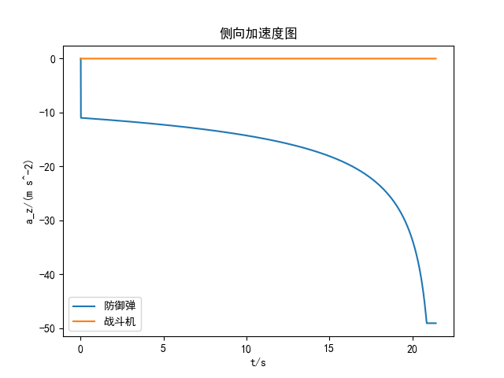
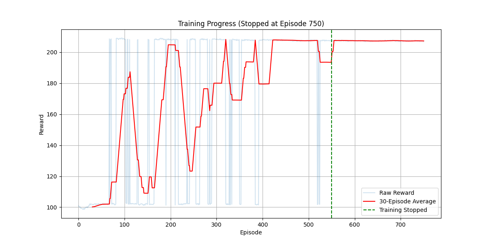

# 基于深度强化学习的战斗机机动突防方法研究 复现
仓库：https://github.com/weilinyin/fighter_Deep_Reinforcement_Learning

## 无突防策略仿真

### 二维

### 三维

## 基于PPO

### 二维

相较于论文增大了一些 $\sigma$ 以加快训练

## GAIL-PPO训练突防网络

### 专家策略构建

根据论文第四章部分和 **王晓芳,张欣,林平,等.基于最优控制的突防和打击一体化策略[J].飞行力学,2022,40(06): 51-60+71**
$$
\begin{equation}
a_{E1} = 
\begin{cases}
    \dfrac{2K_{FD} r_{FD} e^{K_{FD}(t_f - t)}}{\,1 - e^{2K_{FD}(t_f - t_0)}\,} \cdot \dfrac{c_0 e^{K_{FD}(t_f - t_0)} - c_f}{\cos(q_{FD} - \psi_{VF})}, & t_0 \leq t \leq t_f \\
    NV_F \dot{q}_{FT}, & t > t_f
\end{cases}
\end{equation}
$$
其中，
$$
c = \dot q_{z_{FD}}\\
K_{FD} = \dfrac{(N-2)\dot r_{FD}}{r_{FD}}\\
t_f = t_0 - \dfrac{r_{FD}}{\dot r_{FD}} - t_b\\
c_f = -0.002 \\
t_b = 0.5 s
$$

### 仿真

可以看出，GAIL-PPO算法训练的突防网络显著加快了收敛速度

