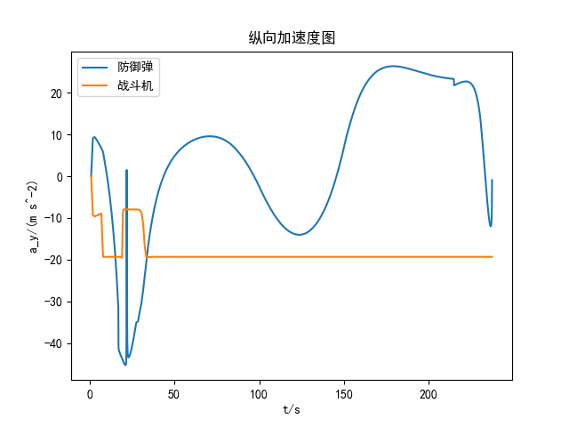

# 基于深度强化学习的战斗机机动突防方法研究 复现
仓库：https://github.com/weilinyin/fighter_Deep_Reinforcement_Learning

## 无突防策略下的三维仿真

## 基于PPO，三维突防场景

使用作者的0.01s时间步长（没有明确给出，图片中暗示了），计算量极大，且完全训不出来。(详见2D_version分支)

开始训练时的每回合奖励显著低于论文标称值 。 但是调整步长为1s，在距离较近时改为0.1s，发现能训练出来。

图中防御弹位置有一个跳跃，这是切换步长导致的bug，但模拟运动使用的是相对位置，这只是一个视觉上的问题。

